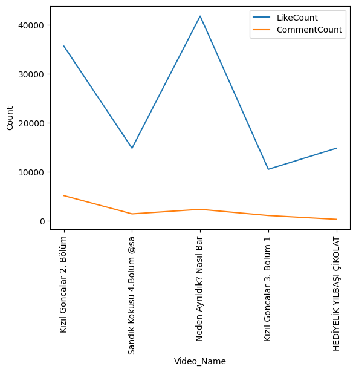
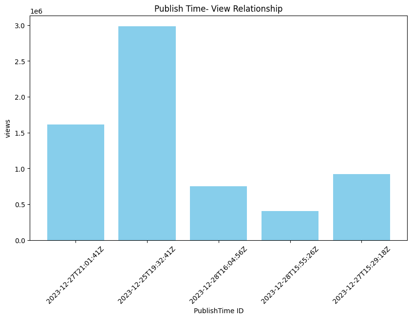
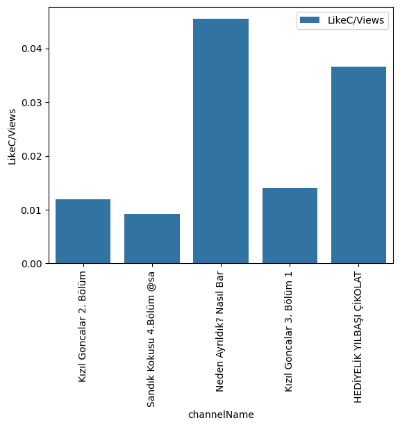
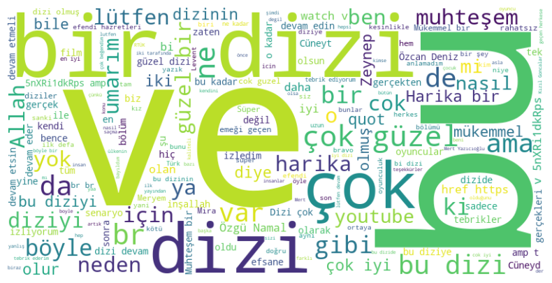
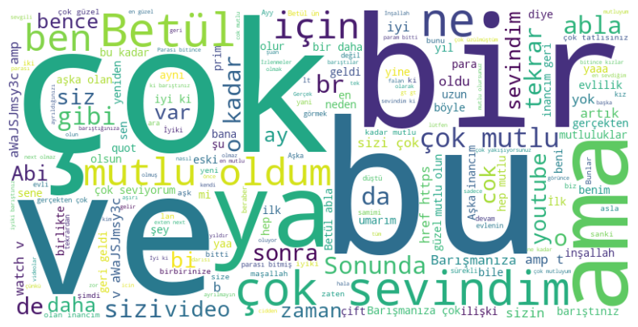

# Youtube_api-Project

An example project for data science that using Youtube API.

- Source: https://developers.google.com/youtube/v3/getting-started

## Requirements

- google-api-python-client

    --> to install: pip install --upgrade google-api-python-client

- Create config folder that contains config.py

    --> Add your YOUTUBE_API_KEY inside config.py

    ## About Files
    - [Youtube_Channels_PlaylistItems](Youtube_Channels_PlaylistItems.ipynb)
    The folder that investigate the Channels and Playlistitems.

    - [Youtube_Videos_CommentThreads](Youtube_Videos_CommentThreads.ipynb)
    The folder that investigate the Videos are belong toh the most views in Turkey and CommentThreads

    - [api_methods](api_methods.py) methods that ı use in this folder. There are 5 methods for all analysis
    - [analysis](analysis.ipynb) : My all analysis in Channels & PlaylistItems Analysis

    ## Path General

    1. Set Up Google API Project:

    - Go to the Google Developers Console.
    - Create a new project or select an existing one.
    - Enable the "YouTube Data API v3" for your project.
    - Create credentials (API key or OAuth client ID) to authenticate your requests.

    2. Install Required Libraries:
    - You need to install the **google-api-python-client** library. You can install it using:

    3. Do your analysis according to the documentation.

    ## Path for our project

    - Your main aim : Pull response and turn to json method and do analyze from this structure.

    Example file : https://github.com/nurfkutlu/Youtube_API_Project/blob/main/Youtube_Channels_PlaylistItems.ipynb

    1) Analyze API_Key 
    2) Config.py file create, and paste your API Key
    3) Create your main file % " main_file.ipynb "
    4) Create . ignore
    5) Start analyze your API Key web page 
       
        I analyzed Channels, PlaylistItems,Videos,CommentTreads.
        Dcument:
        https://developers.google.com/youtube/v3/docs.
        - Channels,Videos,.. --> Overview --> Methods --> List --> Try it now --> Try this method --> Python 

        It gives me lots of codes . Client type, ı will use by API Key .

        See exact path from  **Youtube_API_expanded.ipynb> Path Section**
    6) Analyze data that pull response and turn to json method.
       To analyze by json method ;
       You can use this web pages :
       - https://www.objgen.com/json/local/rh49EaBVJ
       - https://jsonformatter.org/json-editor

For visualisation source :https://medium.com/@fatmanurkutlu1/right-chart-type-for-data-visualization-in-python-1e90b7d22696

## Project Conclusion by Example Graphs
For : [Youtube_Videos_CommentThreads](Youtube_Videos_CommentThreads.ipynb)

### 1. The highest video views : video likes and comment count 

- As you see Kızıl Goncalar and Sandık Kokusu ( Turkısh new trend movies) has highest view but has low like count according to the short daily influencer video ( Neden ayrıldık?Nasıl Bar & Hediyelik Yılbaşı Çik.). 
* Videos are sorted by descending.

### 2. PublishTime & View Relation
- Reaction changes According to the audience and video relation

### 3. The most repeated words in videos
#### Kızıl Goncalar  ;

We can see that ;
 - supportive and positive comments of audiences
 - popular TV actor names that liked by audiences
 - some wishes for movie future

#### Neden Ayrıldık? Neden barıştık

We can see that ;
- supportive,positive and critical comments of audiences
- We also notice many comments stating that they engage in such behavior for money.
- Influencer private life is so attractive for people we can see that like and comment counts and popular comment words.
